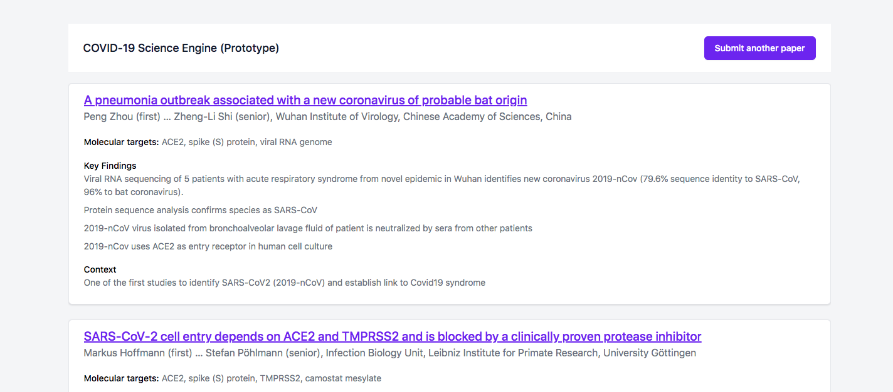

# COVID science engine: crowdsourced papers prototype

A website for researchers to search papers related to COVID-19.

Biomedical researchers have to painstakingly search for relevant information in thousands of papers and in each paper in a lot of irrelevant text.

We want to use a combination of human and machine intelligence to accelerate this process drastically. We are building an NLP algorithm that is able to extract meaningful information and contextualize it. In the meantime, we are allowing information to be manually submitted
so we can build a useful database of papers.



Summaries and metadata can be manually submitted (this will be automated later)

The prototype is available at https://covid-science-engine-prototype.herokuapp.com/ (currently password protected)

## Developer setup
The stack is:

- Ruby on Rails 6.0
- Tailwind CSS
- Postgres
- Heroku

### Installation

Install and start postgresql:
- On macOS, you can use `pg_ctl -D /usr/local/var/postgres start`
- (To stop postgres use `pg_ctl -D /usr/local/var/postgres stop`)

Install dependencies:

```
bundle install
yarn install
```

Setup the database and seed data:

```
rails db:setup
```

## Configuration

The following environment variables can be set:

| Environment variable | Description |
| ---------------------|--------------------------|
| `AUTH_USERNAME`      | Username for basic authentication |
| `AUTH_PASSWORD`      | Password for basic authentication |


## Launch app

```
rails server
```

Then go to [http://localhost:3000](http://localhost:3000) to view the app.

Currently, we have some basic authentication in front of the website. We will be replacing this with something better soon.

In development, the username and password is `foo` /  `bar`.

## Running tests

```
rails spec
```

# Contributing
We are looking for new contributors to help us build this project.

👉 Please read our [Contributing guide](CONTRIBUTING.md) to get started. 👈

You can also join are [Discord server](https://discord.gg/V6kzVAS) to ask questions.

# License

This code uses the [MIT license](LICENSE).
